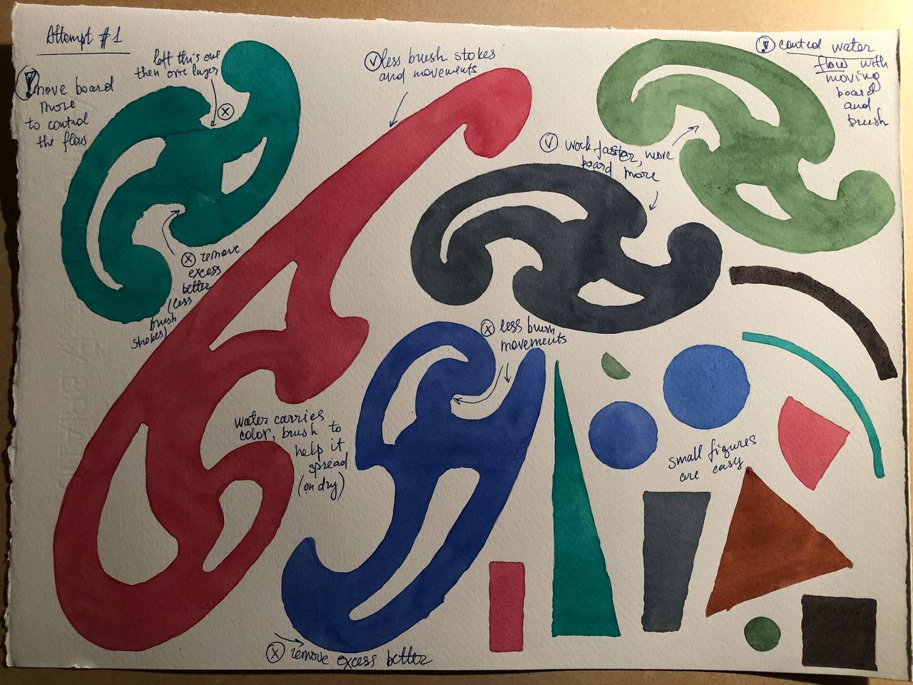
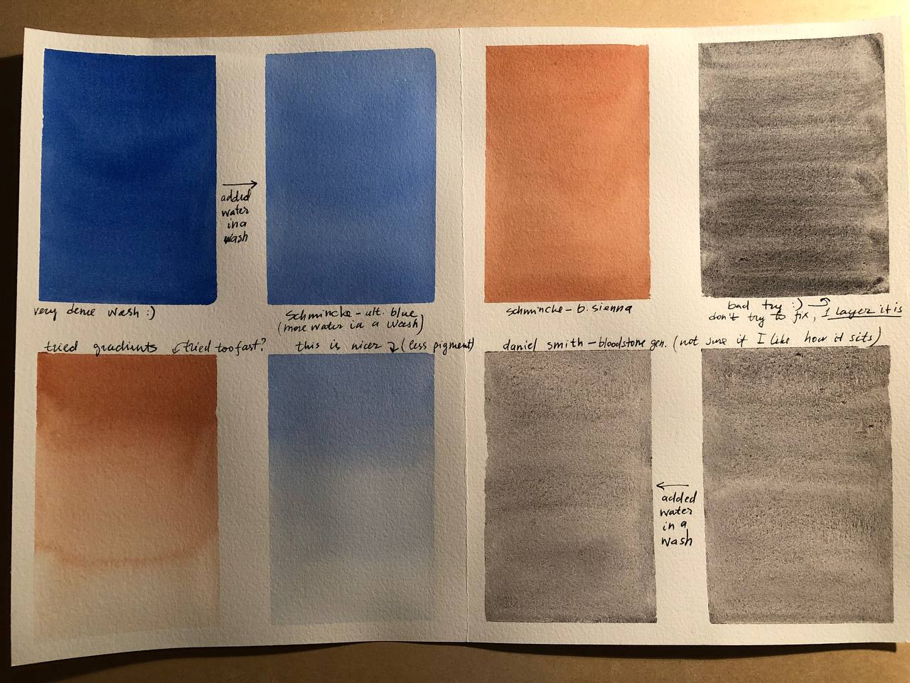

# Flat wash study

Video tutorials:
- [Flat wash video 1](https://www.youtube.com/watch?v=NAZGGY9snwE) 
- [Flat wash video 2](https://www.youtube.com/watch?v=efSp9VWnft8)

Flat wash can be performed on charts and using simple figures.

To come up with simple figures I suggest using [french rulers](https://www.etsy.com/au/market/french_curve) or draw big letters that you can fill in with color (see first video).

With figures like french curves it becomes quite challenging to keep the wash even, so you get to play with controlling water flow a lot by moving the board in 360 degrees area. It's a lot of fun and gives a very good sense of how watercolor works. Sometimes it feels like moving water from one bucket to another.

Remember to **take notes and analyse the study**.

See examples of how it looks like:

Charts

Figures

